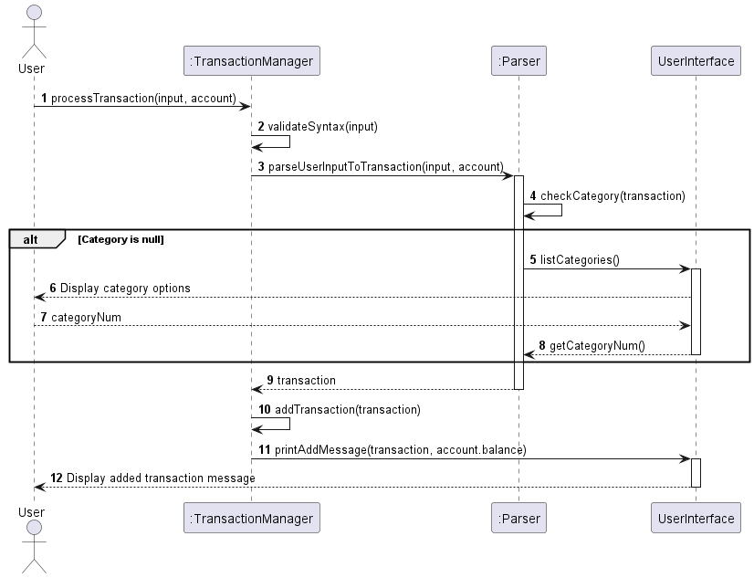
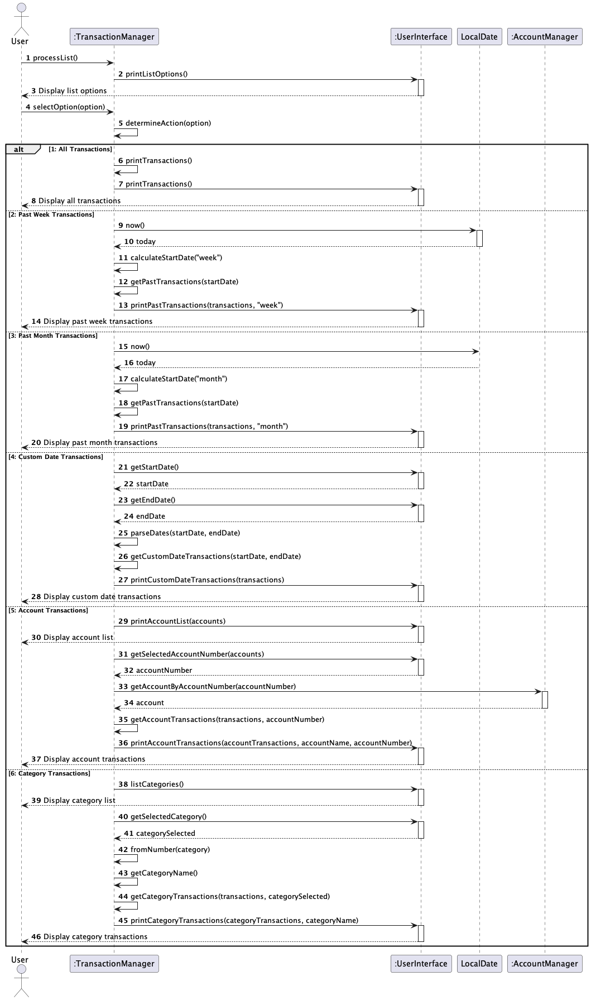

# Developer Guide

## Acknowledgements

{list here sources of all reused/adapted ideas, code, documentation, and third-party libraries -- include links to the
original source as well}

## Design & implementation

{Describe the design and implementation of the product. Use UML diagrams and short code snippets where applicable.}

### [Implemented] Add Account

#### Description

This method is used to add a new account to the list of accounts based on the user input provided. The input should
include the account name and initial balance. After the account is successfully added, the account balance is
initialized with the provided initial balance, and a unique account number is generated and assigned to the account. A
message is displayed to the user indicating the success of the operation. This allows users to manage multiple accounts
by adding new ones as needed.

#### Parameters

1. String input: A string containing the user input, which should include the account name and initial balance,
   separated by specific delimiters.

#### Design and Implementation

The method starts by validating the syntax of the user input to ensure it contains the necessary delimiters for the
account name and initial balance. If the input does not meet the expected format, it throws an
InvalidArgumentSyntaxException. It then parses the input to extract the account name and initial balance. If either the
name or initial balance is missing or empty, an EmptyArgumentException is thrown. Additionally, if the initial balance
is not a valid double value, a NumberFormatException is thrown.

After successfully parsing and validating the input, the method proceeds to generate a unique account number for the new
account. It ensures that the generated number is not already in use by any existing account. Once a unique number is
obtained, a new Account object is created with the generated account number, provided account name, and initial balance.
This new account is then added to the list of accounts, and its number is added to the list of existing account numbers
to ensure uniqueness.

Finally, the method notifies the user of the successful addition of the account by displaying the details of the newly
created account.

The following sequence diagram shows how the add account process works:

### [Implemented] Category feature

#### Description

The Category feature empowers users to effectively categorize transactions based on their preferences. When initiating a
new transaction through the `Add` command, users are prompted to select a category from a predefined list. This ensures
organized and streamlined transaction management.

#### Design and Implementation

The implementation of the Category feature revolves around the integration of a `category` attribute within each
transaction object. This attribute is defined as a member of the `Category` enum class.

Upon invoking the `Add` command, users are presented with a selection prompt featuring the available categories. User
input, typically in the form of a numerical identifier corresponding to a category within the enum class, facilitates
the assignment of the appropriate enum object to the transaction's category attribute.

### [Implemented] Process transaction

#### Description

This method adds a transaction to the list of transactions based on the necessary input details given by the user.

#### Parameters

1. String input: A string containing the user input, which should include the `NAME`, `AMOUNT`, `DATE` and `TYPE` of the
   transaction.
2. Account account: The account object associated with the transaction list.

#### Design and Implementation

1. ##### Syntax Validation:

   The method first checks whether the input string contains all necessary arguments ("/a/", "/t/", "/n/", "/$/", "/d/")
   required for adding a transaction. If any argument is missing, it throws an InvalidAddTransactionSyntax exception.

2. #### Transaction Parsing:

   It utilizes a parser object to parse the user input string into a Transaction object using the
   parseUserInputToTransaction method.

3. #### Assertion Checks:

   Assertions are used for debugging purposes to ensure that the parsed transaction and added transaction are not null.
   If they are null, assertion errors are thrown.

4. #### Category Assignment:

   If the category of the transaction is null, it prompts the user to choose a category from a list and assigns the
   chosen category to the transaction.

5. #### Transaction Addition:

   After parsing and category assignment, the transaction is added to the account using the addTransaction method.

6. #### Feedback to User:

   Upon successful addition of the transaction, a message is printed to the user indicating the details of the added
   transaction and the updated account balance.

#### Exceptions:

1. `InvalidTransactionTypeException`: This exception is thrown when the transaction type is not one of `income`
and `expense`.

2. `InvalidAddTransactionSyntax`: This exception is thrown when the syntax of the add transaction is invalid.

3. `EmptyArgumentException`: This exception is thrown when an empty argument is encountered.

The following sequence diagram shows how a remove transaction goes works:

### [Implemented] Remove transaction

#### Description

This method is used to remove a transaction from the list of transactions based on the transaction ID provided
by the user. After the transaction is removed, the account balance is updated accordingly and a message is
displayed to the user indicating the success of the operation. This helps user to remove the transaction
from the list they added by mistake or those transactions they no longer need to keep track off.

#### Parameters

1. String input: A string containing the user input, which should include the transaction ID to be removed.
2. Account account: The account object associated with the transaction list.

#### Design and Implementation

The method first validates the user input to ensure it's not empty or null. If the input is invalid, it throws
an EmptyArgumentException. Next, it extracts the transaction ID from the input and verifies its integrity as a
valid integer. If the ID is invalid, a NumberFormatException is thrown.

Once a valid transaction ID is obtained, the method calculates its corresponding index in the transactions
ArrayList by subtracting 1 from the provided ID, as ArrayList indices start from 0 . It then verifies
if the calculated index falls within the bounds of the ArrayList. If the index is out of bounds, an
InvalidIndexException is thrown.

Upon successful validation, the method removes the transaction at the calculated index from the transactions
ArrayList. Subsequently, it updates the account balance to reflect the removed transaction. Finally, it
notifies the user of the successful removal along with displaying the details of the removed transaction.

The following sequence diagram shows how a remove transaction goes works:

### [Implemented] Edit Transaction

#### Description

This method facilitates the editing of a transaction within the list of transactions associated with a
specific account. Users can edit transactions by providing the index of the transaction they wish to modify
along with the updated transaction details. After the edit operation is completed, the system updates the
transaction accordingly and notifies the user of the successful operation. This feature enhances user
flexibility by allowing them to correct erroneous transactions or update transaction details as needed.

#### Parameters

1. String input: A string representing user input, including the index of the transaction to be edited and
   the updated transaction details.
2. Account account: The account object associated with the transaction list.

#### Design and Implementation

The processEditTransaction method follows a structured approach to ensure the successful editing of
transactions while maintaining data integrity:

1. Input Validation: The method begins by validating the user input to ensure it is not empty or null. If
   the input is invalid, an EmptyArgumentException is thrown to prompt the user to provide valid input.
2. Transaction Index Extraction: After validating the input, the method extracts the index of the
   transaction to be edited from the input string. It ensures the extracted data is a valid integer; otherwise, a
   NumberFormatException is thrown to indicate invalid input.
3. Index Calculation: Once a valid transaction index is obtained, the method calculates the corresponding
   index in the transactions ArrayList. As ArrayList indices start from 0, the provided index is decremented
   by 1 to align with the ArrayList index.
4. Index Bounds Verification: The method verifies whether the calculated index falls within the bounds of
   the transactions ArrayList. If the index is out of bounds, an InvalidIndexException is thrown to notify the user of
   the invalid index provided.
5. Transaction Editing: Upon successful validation, the method retrieves the transaction object at the
   calculated index from the transactions ArrayList. It prompts the user to input the updated transaction details
   through the UserInterface.getEditInformation() method. The edited transaction is then parsed using the
   parser.parseTransactionType() method to ensure its validity and association with the provided account. Finally, the
   edited transaction replaces the original transaction at the specified index in the transactions ArrayList using the
   transactions.set() method.
6. User Notification: After editing the transaction, the method notifies the user of the successful
   operation by displaying a message through the UserInterface.printUpdatedTransaction() method.

Sequence Diagram
The following sequence diagram illustrates the sequence of interactions involved in the editing of a transaction:

### [Implemented] List feature

### Description

The list feature allows users to view their existing transactions. This feature includes viewing all the transactions,
past week's transactions, past month's transactions and transactions from a specified date range.

#### Implementation

This feature is facilitated through the `TransactionList#processList`, where it prompts the user for their choice of
list they wish to see. After the user inputs the choice, the get functions will store the transactions in a new
ArrayList and `UserInterface#printPastTransactions` will handle the output of the list.

Sequence Diagram
The following sequence diagram illustrates the sequence of interactions involved in the editing of a transaction:

## Product scope

### Target user profile

{Describe the target user profile}

### Value proposition

{Describe the value proposition: what problem does it solve?}

## User Stories

| Version | As a ... | I want to ...             | So that I can ...                                           |
|---------|----------|---------------------------|-------------------------------------------------------------|
| v1.0    | new user | see usage instructions    | refer to them when I forget how to use the application      |
| v2.0    | user     | find a to-do item by name | locate a to-do without having to go through the entire list |

## Non-Functional Requirements

{Give non-functional requirements}

## Glossary

* *glossary item* - Definition

## Instructions for manual testing

{Give instructions on how to do a manual product testing e.g., how to load sample data to be used for testing}
