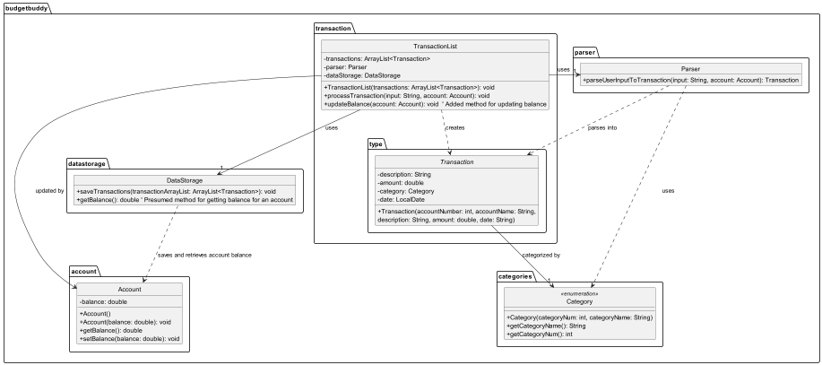
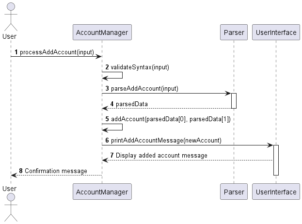
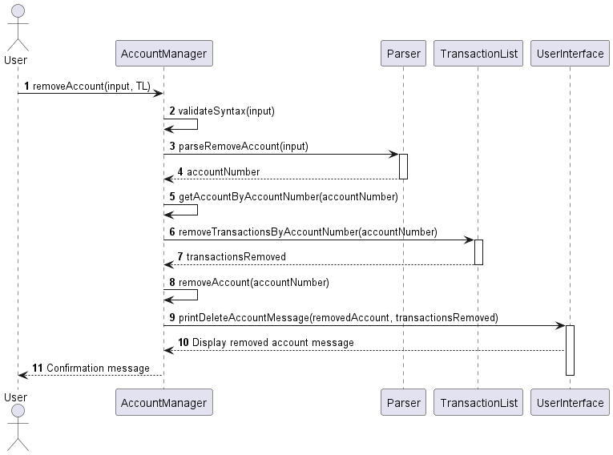
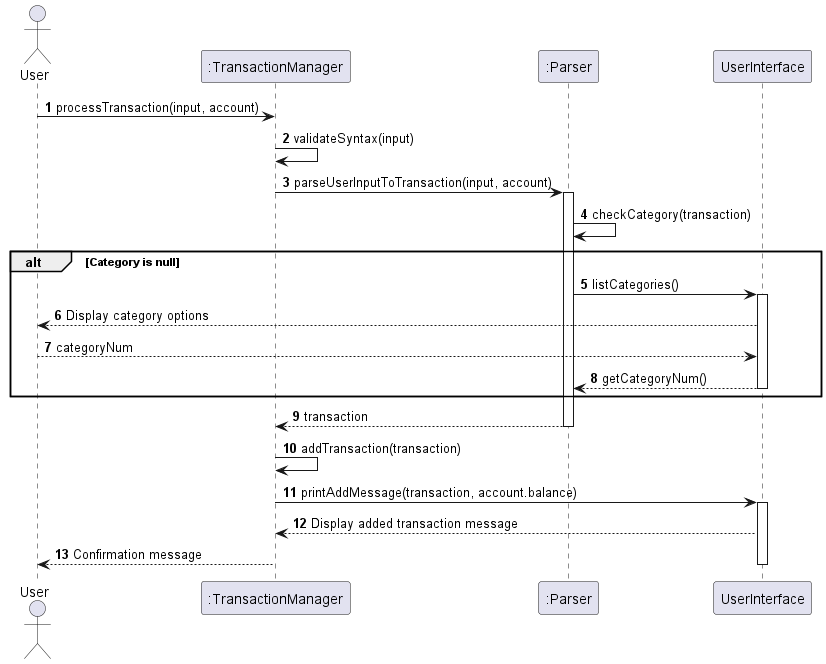
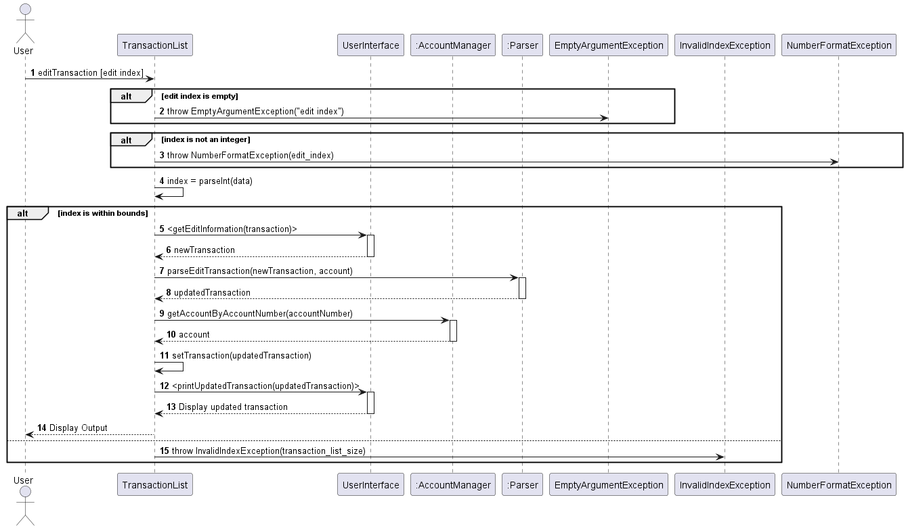
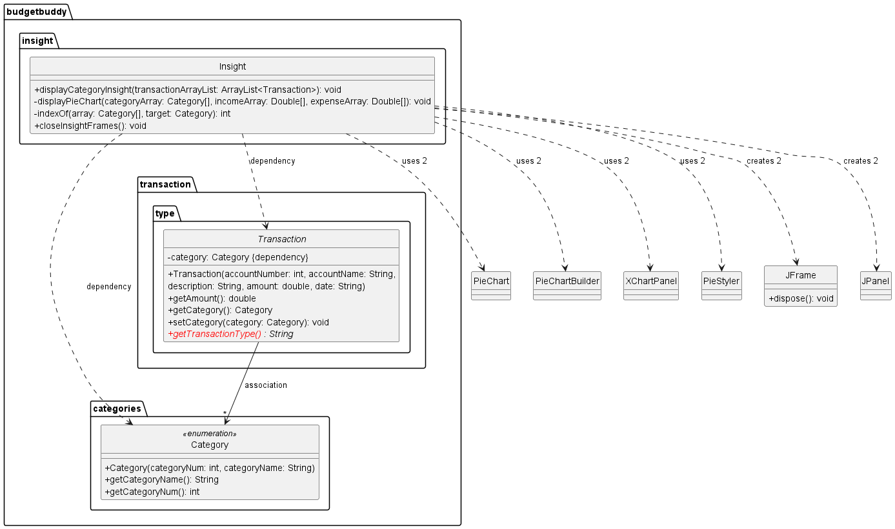

# Developer Guide

## Acknowledgements

* [XChart](https://knowm.org/open-source/xchart/) - open source library, has been used in this project 
as a data visualization tool. 

## Design & implementation

### Architecture

The **Architecture Diagram** of BudgetBuddy is shown below. It explains the high-level design of the application. <br>


**Main components of the architecture:**

The bulk of BudgetBuddy work is done by these following four components:

* `BudgetBuddy` class: is the main class of the application, in charge of the app launch,
  shut down and reading user's inputs. It invokes the loading and saving of data when the app is launched/shut down.
* `ui` package: consists of `Ui` class, which deals with all the printing/output to the user,
  and also some reading of user's inputs for additional data.
* `parser` package: consists of the `Parser` class, makes sense of the data input by the user
  to provide meaningful data for other methods.
* `storage` package: consists of `DataStorage` class, in charge of saving and loading of the `data` files.

These components help to manipulate the `Transaction`, `TransactionList`, `Account` and `AccountManager` classes
which drives BudgetBuddy. <br> <br>

### [Implemented] Add Account

#### Description

This method is used to add a new account to the list of accounts based on the user input provided. The input should
include the account name and initial balance. After the account is successfully added, the account balance is
initialized with the provided initial balance, and a unique account number is generated and assigned to the account. A
message is displayed to the user indicating the success of the operation. This allows users to manage multiple accounts
by adding new ones as needed.

#### Parameters

1. String input: A string containing the user input, which should include the account name and initial balance,
   separated by specific delimiters.

#### Design and Implementation

The method starts by validating the syntax of the user input to ensure it contains the necessary delimiters for the
account name and initial balance. If the input does not meet the expected format, it throws an
InvalidArgumentSyntaxException. It then parses the input to extract the account name and initial balance. If either the
name or initial balance is missing or empty, an EmptyArgumentException is thrown. Additionally, if the initial balance
is not a valid double value, a NumberFormatException is thrown.

After successfully parsing and validating the input, the method proceeds to generate a unique account number for the new
account. It ensures that the generated number is not already in use by any existing account. Once a unique number is
obtained, a new Account object is created with the generated account number, provided account name, and initial balance.
This new account is then added to the list of accounts, and its number is added to the list of existing account numbers
to ensure uniqueness.

Finally, the method notifies the user of the successful addition of the account by displaying the details of the newly
created account.

The following class diagram shows the associations between classes involved in adding an account.



The following sequence diagram shows how the add account process works:

<br> <br>

### [Implemented] Remove Account

#### Description

This method is used to remove an existing account from the system based on the account number provided by the user
input. It checks for the existence of the account in the system, and if found, it removes the account and any associated
transactions, displaying a message indicating successful removal. This allows users to manage their accounts effectively
by removing unnecessary or outdated accounts.

#### Parameters

1. String input: A string containing the user input, which should include the account number to be removed, parsed using
   specific delimiters.

#### Design and Implementation
 
The method begins by validating the presence of the account number in the user input. If the format is incorrect, it
throws an `InvalidArgumentSyntaxException`. If the account number is missing or the format is incorrect (not a valid
integer), a `NumberFormatException` or `EmptyArgumentException` is thrown.

After validating and parsing the account number, it checks if removing the account would result in no accounts left,
which is not allowed. If valid, it proceeds to remove the account by the account number. It also removes any associated
transactions with this account from the transaction list, ensuring no orphan transactions remain.

Finally, the method updates the system's account list and transaction list to reflect the removal and notifies the user
of the successful operation by displaying relevant details of the removed account and transactions.

The following sequence diagram shows how the remove account process works:



**Additional Notes**  
The method ensures that the system's integrity is maintained by not allowing the last account to be removed, which is
handled gracefully with appropriate user notifications. The removal process also involves updating various components of
the system to reflect the changes accurately.<br> <br>

### [Implemented] Category feature

#### Description

The Category feature empowers users to effectively categorize transactions based on their preferences. When initiating a
new transaction through the `Add` command, users are prompted to select a category from a predefined list. This ensures
organized and streamlined transaction management.

#### Design and Implementation

The implementation of the Category feature revolves around the integration of a `category` attribute within each
transaction object. This attribute is defined as a member of the `Category` enum class.

Upon invoking the `Add` command, users are presented with a selection prompt featuring the available categories. User
input, typically in the form of a numerical identifier corresponding to a category within the enum class, facilitates
the assignment of the appropriate enum object to the transaction's category attribute.<br> <br>

### [Implemented] Process transaction

#### Description

This method adds a transaction to the list of transactions based on the necessary input details given by the user.

#### Parameters

1. String input: A string containing the user input, which should include the `NAME`, `AMOUNT`, `DATE` and `TYPE` of the
   transaction.
2. Account account: The account object associated with the transaction list.

#### Design and Implementation

1. ##### Syntax Validation:

   The method first checks whether the input string contains all necessary arguments ("/a/", "/t/", "/n/", "/$/", "/d/")
   required for adding a transaction. If any argument is missing, it throws an InvalidAddTransactionSyntax exception.

2. #### Transaction Parsing:

   It utilizes a parser object to parse the user input string into a Transaction object using the
   parseUserInputToTransaction method.

3. #### Assertion Checks:

   Assertions are used for debugging purposes to ensure that the parsed transaction and added transaction are not null.
   If they are null, assertion errors are thrown.

4. #### Category Assignment:

   If the category of the transaction is null, it prompts the user to choose a category from a list and assigns the
   chosen category to the transaction.

5. #### Transaction Addition:

   After parsing and category assignment, the transaction is added to the account using the addTransaction method.

6. #### Feedback to User:

   Upon successful addition of the transaction, a message is printed to the user indicating the details of the added
   transaction and the updated account balance.

#### Exceptions:

1. `InvalidTransactionTypeException`: This exception is thrown when the transaction type is not one of `income`
   and `expense`.

2. `InvalidAddTransactionSyntax`: This exception is thrown when the syntax of the add transaction is invalid.

3. `EmptyArgumentException`: This exception is thrown when an empty argument is encountered.

The following class diagram shows the associations between classes involved in processing a transaction.


The following sequence diagram shows how an add transaction command works:

<br> <br>

### [Implemented] Remove transaction

#### Description

This method is used to remove a transaction from the list of transactions based on the transaction ID provided
by the user. After the transaction is removed, the account balance is updated accordingly and a message is
displayed to the user indicating the success of the operation. This helps user to remove the transaction
from the list they added by mistake or those transactions they no longer need to keep track off.

#### Parameters

1. String input: A string containing the user input, which should include the transaction ID to be removed.
2. Account account: The account object associated with the transaction list.

#### Design and Implementation

The method first validates the user input to ensure it's not empty or null. If the input is invalid, it throws
an EmptyArgumentException. Next, it extracts the transaction ID from the input and verifies its integrity as a
valid integer. If the ID is invalid, a NumberFormatException is thrown.

Once a valid transaction ID is obtained, the method calculates its corresponding index in the transactions
ArrayList by subtracting 1 from the provided ID, as ArrayList indices start from 0 . It then verifies
if the calculated index falls within the bounds of the ArrayList. If the index is out of bounds, an
InvalidIndexException is thrown.

Upon successful validation, the method removes the transaction at the calculated index from the transactions
ArrayList. Subsequently, it updates the account balance to reflect the removed transaction. Finally, it
notifies the user of the successful removal along with displaying the details of the removed transaction.

The following sequence diagram shows how a remove transaction goes works:

<br> <br>

### [Implemented] Edit Transaction

#### Description

This method facilitates the editing of a transaction within the list of transactions associated with a
specific account. Users can edit transactions by providing the index of the transaction they wish to modify
along with the updated transaction details. After the edit operation is completed, the system updates the
transaction accordingly and notifies the user of the successful operation. This feature enhances user
flexibility by allowing them to correct erroneous transactions or update transaction details as needed.

#### Parameters

1. String input: A string representing user input, including the index of the transaction to be edited and
   the updated transaction details.
2. Account account: The account object associated with the transaction list.

#### Design and Implementation

The processEditTransaction method follows a structured approach to ensure the successful editing of
transactions while maintaining data integrity:

1. Input Validation: The method begins by validating the user input to ensure it is not empty or null. If
   the input is invalid, an EmptyArgumentException is thrown to prompt the user to provide valid input.
2. Transaction Index Extraction: After validating the input, the method extracts the index of the
   transaction to be edited from the input string. It ensures the extracted data is a valid integer; otherwise, a
   NumberFormatException is thrown to indicate invalid input.
3. Index Calculation: Once a valid transaction index is obtained, the method calculates the corresponding
   index in the transactions ArrayList. As ArrayList indices start from 0, the provided index is decremented
   by 1 to align with the ArrayList index.
4. Index Bounds Verification: The method verifies whether the calculated index falls within the bounds of
   the transactions ArrayList. If the index is out of bounds, an InvalidIndexException is thrown to notify the user of
   the invalid index provided.
5. Transaction Editing: Upon successful validation, the method retrieves the transaction object at the
   calculated index from the transactions ArrayList. It prompts the user to input the updated transaction details
   through the UserInterface.getEditInformation() method. The edited transaction is then parsed using the
   parser.parseTransactionType() method to ensure its validity and association with the provided account. Finally, the
   edited transaction replaces the original transaction at the specified index in the transactions ArrayList using the
   transactions.set() method.
6. User Notification: After editing the transaction, the method notifies the user of the successful
   operation by displaying a message through the UserInterface.printUpdatedTransaction() method.

Sequence Diagram
The following sequence diagram illustrates the sequence of interactions involved in the editing of a transaction:
<br> <br>

### [Implemented] Search Transactions

### Description

This method enables users to search for transactions based on a keyword. Users provide a keyword, and the system
searches through transaction descriptions, amounts, categories, and dates to find matches. The search results,
along with their corresponding indices in the transactions list, are displayed to the user.

#### Design and Implementation

1. **Keyword Extraction:** The method extracts the keyword from the user input.

2. **Search Process:** It iterates through the list of transactions, checking if any transaction's
   description, amount, category, or date contains the keyword. Matches are added to a list of search
   results along with their corresponding indices in the transactions list.

3. **Output Generation:** Once the search process is completed, the method generates output by displaying the
   search results along with their indices to the user.

4. **Exception Handling:** The method handles exceptions such as an empty keyword input or any unexpected
   errors during the search process. Proper error messages are displayed to the user in case of exceptions.

Example Algorithm:

```
searchTransactions(input)  
      1. Extract the keyword from the user input.
      2. Initialize empty lists for search results and indices.
      3. For each transaction in transactions do:
         1. Convert transaction description to lowercase (description_lower).
         2. Convert transaction amount to string (amount_str).
         3. Convert category name to lowercase (category_name).
         4. Convert transaction date to string (date_str).
         5. If keyword is present in description_lower, amount_str, category_name_lower, or date_str then:
            - Add the transaction to the search results list.
            - Add the index of the transaction in transactions to the indices list.
      4. Display the search results along with their indices to the user.
      5. Catch ArrayIndexOutOfBoundsException:
         - Print "Invalid search input."
      6. Catch Exception:
         - Print the exception message.
``` 
   
### [Implemented] List Transactions

### Description

The list feature allows users to view their existing transactions. This feature includes viewing all the transactions,
past week's transactions, past month's transactions, transactions from a specified date range, transactions from a
specified account and transactions of a particular category.

#### Design and Implementation

This feature is facilitated through the `TransactionList#processList`, and it is designed to ensure successful viewing
of the desired list as inputs are required in a bite-sized manner.

This method first executes the `UserInterface#printListOptions` to show users the list options and their indexes which
is needed for their inputs. The method will throw an InvalidIndexException if the input is out of the range (range 1-6).
Depending on the list option chosen by the user, the case statement of the `TransactionList#processList` will run, and
execute the method of the corresponding option. Different methods would have different prompts as more information is
required from the user. For the example of custom date transactions, `TransactionList#getCustomDateTransactions` will
call the methods: `UserInterface#getStartDate` and `UserInterface#getEndDate` in order to obtain the desired date range
from the user. Once all the required information is gathered for the particular option, an ArrayList will be created and
the desired transactions will be added into that ArrayList. Then, this ArrayList will be printed out, displaying the
transactions of the chosen option.

Sequence Diagram <br>
The following sequence diagram illustrates the sequence of interactions involved in the editing of a transaction:
<br> <br>

### [Implemented] Insights

#### Description

This feature provides insights into the categorized expenses and incomes of the user. It utilizes the Insight
class to calculate and display pie charts representing the distribution of expenses and incomes across
different categories. <br>

#### Design and Implementation

1. The displayCategoryInsight method iterates through the list of transactions and calculates the total income
   and expense amounts for each category. It then calls the displayPieChart method to visualize these insights
   using pie charts.

2. The displayPieChart method creates separate pie charts for income and expense categories using the XChart
   library. It customizes the appearance of the charts and adds series for each category with their respective
   income or expense amounts.

3. The indexOf method is a private helper function used to find the index of a specific category within an
   array
   of categories.

4. The closeInsightFrames method is responsible for closing any open frames related to insights, specifically
   targeting frames related to income and expense insights to ensure proper cleanup and resource management.

The following is the class diagram for Insights class



## Product scope

### Target user profile:

* has a need to manage significant number of day-to-day transactions
* prefer desktop apps over other types
* can type fast
* prefers typing to mouse interactions
* is reasonably comfortable using CLI apps

### Value proposition:

* manage daily transactions faster than a typical mouse/GUI driven app

## User Stories

| Version | As a ... | I want to ...                                      | So that I can ...                                     |
|---------|----------|----------------------------------------------------|-------------------------------------------------------|
| v1.0    | user     | Update my daily expense                            | Manage my transactions                                |
| v1.0    | user     | Exit from the interface                            | Stop the application                                  |
| v1.0    | user     | Know how to communicate with the bot               | Use it effectively                                    |
| v1.0    | user     | View my past transactions                          | Keep track of them                                    |
| v1.0    | user     | Delete a transaction                               | Remove a transaction I added by mistake               |
| v1.0    | user     | Add income as well as expense transactions         | Track my balance                                      |
| v2.0    | user     | Keep track of my balance                           | Know how much money I have left                       |
| v2.0    | user     | Choose the date range to view my transactions      | View transactions that I am interested in only        |
| v2.0    | user     | Track multiple balances such as wallet, debit card | Know how much money I have left in all accounts       |
| v2.0    | user     | Get a quick view of my past week's transactions    | Obtain a quick overview of my recent spending history |
| v2.0    | user     | Categorize my transactions                         | Get insights on each category                         |

## Non-Functional Requirements

1. Should work on any *mainstream OS* as long as it has Java `11` or above installed.
2. A user with above average typing speed for regular English text (i.e. not code, not system admin commands) should be
   able to accomplish most of the tasks faster using commands than using the mouse.

## Glossary

* **Mainstream OS**: Windows, Linux, Unix, macOS

## Instructions for manual testing

### Add transaction
With the help of help guide you can add a transaction (assuming account number is 5413)
 * Run the following command: `add /a/5431 /t/Income /n/March Salary /$/10000 /d/01-03-2024 /c/8`
   Expected : Received acknowledgement and transaction is added to the list.
 * Run the following command: `add /a/5431 /t/new /n/March Salary /$/10000 /d/01-03-2024 /c/8`
   Expected: Error occurred with a message. Transaction is not added
 * Run the following command : `add /a/5431 /t/Income /n/March Salary /$/10000 /d/01-20-2024 /c/8`
   Expected: Error occurred due to date format. Transaction is not added
 * Run the following command : `add /a/5431 /t/Income /n/March Salary /$/10000 /d/01-03-2024 /c/10`
   Expected: Invalid category. Transaction is not added.

### Edit Transaction
With the help of help guide you can edit a transaction (assuming there are only 2 transactions in the history)
* Run the following command: `edit 3`
  Expected: Error occurred due to index id is out of the range.
* Run the following command : `edit 0`
  Expected: Error occurred due to index id is out of the range.
* Run the following command : `add-acc /n/DBS Savings /$/hundred`
  Expected: Error occurred due to invalid initial balance. Initial balance should be double not a string.
* Run the following command: `edit 1`
  Expected : Details of the transaction is shown, and new input for each argument.


### Add account
With the help of help guide you can add a new account
* Run the following command: `add-acc /n/DBS Savings /$/10000`
  Expected : Received acknowledgement and account is added successfully.
* Run the following command: `add-acc /n//$/10000`
  Expected: Error occurred due to empty account name. Account not added.
* Run the following command : `add-acc /n/DBS Savings /$/`
  Expected: Error occurred due to missing initial balance. Account not added.
* Run the following command : `add-acc /n/DBS Savings /$/hundred`
  Expected: Error occurred due to invalid initial balance. Initial balance should be double not a string.
  Account not added


